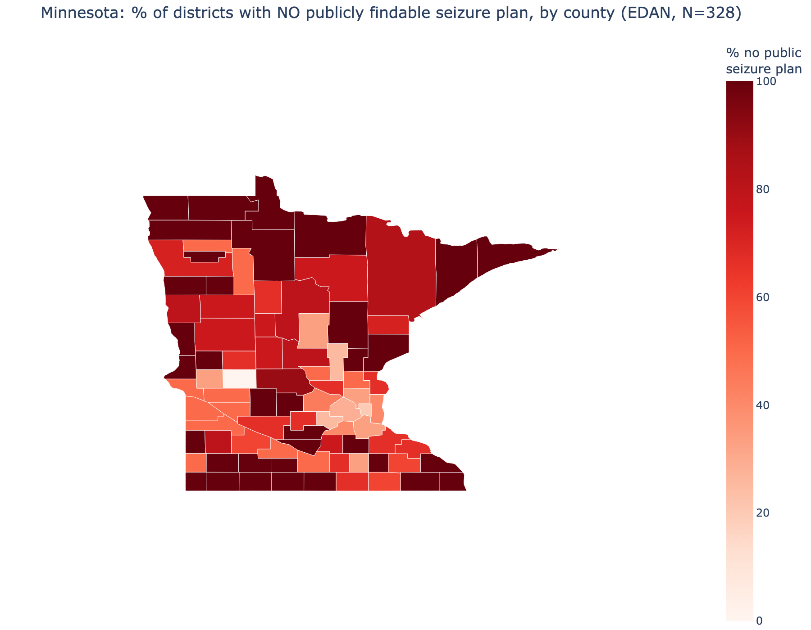

# 5. The Data: Mapping the Gaps

This chapter is the research heart of the book. We asked a simple question with a measurable
answer: **how many Minnesota school districts post a seizure plan that families and staff can
actually find?**

## How we measured it
For **328 of Minnesota's ~329 regular public school districts**, we reviewed the official
district website: the school-board policy page (MSBA Policy 516, Student Medication), the
health-services page, and the student/parent handbook. We classified each district into one of
four categories:

| Category | Meaning |
|----------|---------|
| Seizure plan posted | A seizure-specific plan or page is publicly findable |
| Medication policy only | A general medication policy exists, but never mentions seizures |
| Nothing found | No relevant policy posted online |
| Could not check | Site or policies were inaccessible |

!!! warning "What this measures"
    We measured **public findability**, not legal compliance. A district with nothing posted
    may still have an internal plan. That is why this is a starting point for outreach, not a
    verdict on any school.

## What we found
~70% of districts post **no** publicly findable seizure-specific
plan (231 of 328). Only about 30% do.

The gap follows a strong gradient by district type:

| District type | Has a public plan |
|---------------|-------------------|
| City | 77% |
| Suburb | 58% |
| Town | 41% |
| Rural | 20% |

A statistical test confirms this is not chance (chi-square p < 0.0001).

{ .microsim }

## The real driver is size, not "rural"
We built a logistic regression to ask what predicts a public plan. The dominant factor was
**district enrollment** (bigger districts are far more likely to post a plan). Once we
accounted for size, "rural" was no longer a significant predictor on its own.

The honest interpretation: this is a **capacity** problem. Small districts, most of which are
rural, simply do not have the nursing and administrative staff to write and post a current
plan. Minnesota's own data backs this up: about **half of districts have no licensed school
nurse**, and the smallest districts are worst off.

This changes how we help: do not lecture small districts, **do the work for them** with a
ready-to-use packet (see [Chapter 6](../06-how-to-help/index.md)).

## How reliable is this?
We re-checked a random sample of 30 districts with independent reviewers who did not see the
first ratings. They agreed **90% of the time** (Cohen's kappa = 0.82, "almost perfect"). When
they disagreed, the second reviewer usually found *more* seizure content, which means our 70%
figure may slightly **overstate** the gap, an error in the safe direction.

---
*Full methods and numbers are in the project's FINDINGS.md and RELIABILITY.md. Data sources:
NCES/Urban Institute district roster, CDC PLACES county health data, MDH school-nurse report.*
